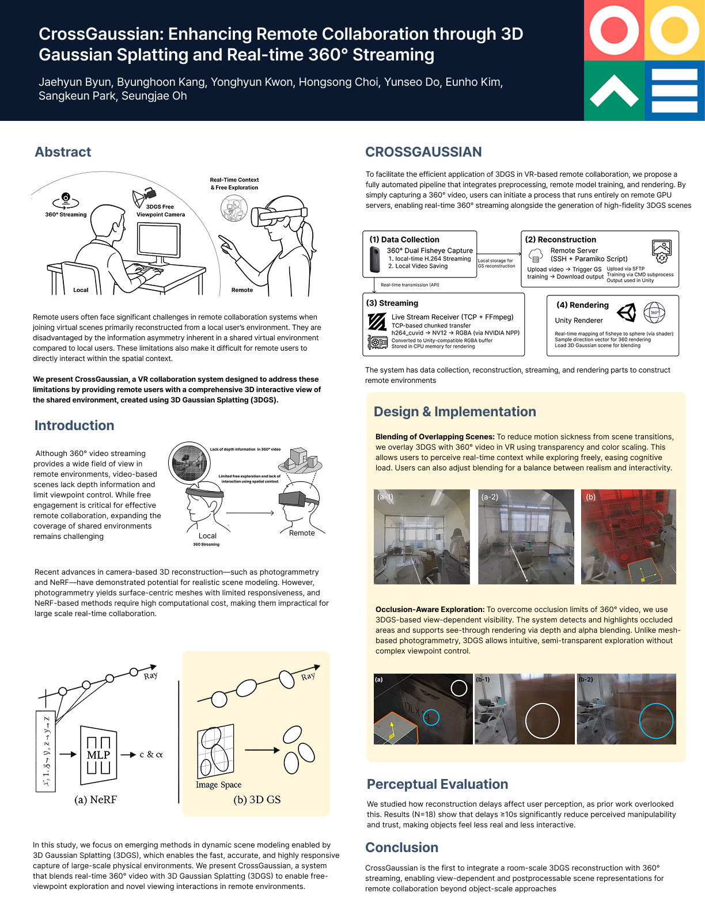

<div align="center">

# 🌐 CrossGaussian
<table>
  <tr>
    <td width="50%">
      
    </td>
    <td width="50%">
<a href="https://www.youtube.com/watch?v=j1E37wnWhfA&t=1s">
  
  <p align="center">🎬 Demo Video</p>
</a>
    </td>
  </tr>
</table>

> Exploring the design space of 3DGS-based spatial visualization and interaction for remote collaboration  
> User study: Reconstruction latency × 18 participants, Friedman + Wilcoxon analysis

</div>

<br>

🔮 CrossGaussian is the first study to integrate room-scale 3D Gaussian Splatting (3DGS) with real-time 360° video streaming for remote collaboration. While 360° cameras provide a wide field of view, the lack of depth information limits free spatial exploration; manual 3D modeling enables such exploration but incurs prohibitive production costs. CrossGaussian integrates the explicit scene representation and real-time rendering capabilities of 3DGS into a game engine, exploring the design space of spatial visualization and interaction techniques for remote collaboration environments.

<br>

🔮 CrossGaussian은 **뉴럴 렌더링 기법인 3D 가우시안 스플래팅(3DGS)과 실시간 360° 비디오 스트리밍을 룸스케일 원격 협업에 최초로 통합한 연구**입니다. 360° 카메라는 넓은 시야각을 제공하지만 깊이 정보가 없어 자유로운 공간 탐색이 제한되고, 수동 3D 모델링은 자유 탐색을 가능케 하지만 제작 비용이 막대합니다. CrossGaussian은 3DGS의 명시적 장면 표현과 실시간 렌더링 특성을 게임 엔진에 통합하여, 원격 협업 환경에서의 공간 시각화 및 상호작용 디자인 스페이스를 탐구합니다.

---

<div align="center">

## 📋 Table of Contents

1. [🎯 Overview](#-overview)
2. [📚 Research Background](#-research-background)
3. [⚙️ System Architecture](#️-system-architecture)
4. [🎨 Design Space](#-design-space)
5. [🔬 User Study](#-user-study)
6. [🏆 Publications](#-publications)

---

</div>

<div align="center">
  
## 🎯 Overview

### 📖 Introduce

**Project**: CrossGaussian  
**Type**: Academic Research (HCI)  
**Duration**: 2024.09 ~ 2025.10  
**Advisors**: Seungjae Oh & Sangkeun Park (KHU)

    |     |   |  

<br>

### 👥 Team

| Position | Role | Name | Affiliation |
|:--|:--|:--|:--|
| 🎯 Research | First Author<br>Research Lead & System Architecture | [Jaehyun Byun](https://github.com/BynPlay) | Kyung Hee Univ.<br>Computer Science |
| 💻 Dev | Co-Author<br>TCP Streaming & Network Protocol | [Byunghoon Kang](https://github.com/dot-mario) | Kyung Hee Univ.<br>Software Convergence |
| 💻 Dev | Co-Author<br>3DGS Rendering & Compute Shader | [Yonghyun Gwon](https://github.com/Noperi0r) | Kyung Hee Univ.<br>Software Convergence |
| 💻 Dev | Co-Author<br>Remote GPU Pipeline | Hongsong Choi | Kyung Hee Univ.<br>Software Convergence |
| 📊 Research | Co-Author<br>Experiment Assistant | Yunseo Do | Kyung Hee Univ.<br> Artificial Intelligence |
| 📊 Research | Co-Author<br>User Study & Data Analysis | Eunho Kim | Kyung Hee Univ.<br>Software Convergence |
| 🎓 Advisor | Academic Advisor | [Sangkeun Park](https://uxc.khu.ac.kr/) | Kyung Hee Univ.<br>UXC Lab |
| 🎓 Advisor | Academic Advisor | [Seungjae Oh](https://item.khu.ac.kr/) | Kyung Hee Univ.<br>ITEM Lab |

</div>

---

<br>

## 📚 Research Background

### 📖 Problem Statement

<div align="center">

</div>

<br>

In co-located collaboration, users freely move through physical spaces, but **remote collaboration severely constrains this autonomy**. When remote participants want to examine objects behind the camera or change viewpoints, they must rely on local collaborators—increasing communication burden and limiting meaningful interaction.

동일 공간 협업에서는 물리적 공간을 자유롭게 이동할 수 있지만, **원격 협업에서는 이러한 자율성이 크게 제한**됩니다. 원격 참여자가 카메라 뒤 물체를 살펴보거나 시점을 변경하려면 현장 협업자에게 의존해야 하며, 이는 의사소통 부담을 증가시키고 의미 있는 상호작용을 제한합니다.

<div align="center">

### Prior Work & Limitations

| Approach | Limitation |
|:--|:--|
| **360° Video Streaming** | Wide FOV but lacks depth—no free spatial exploration<br>넓은 시야각이지만 깊이 정보 부재—자유로운 공간 탐색 불가 |
| **Manual 3D Modeling** | Enables free exploration but labor-intensive and costly<br>자유 탐색 가능하지만 제작에 많은 시간과 비용 소요 |
| **Photogrammetry** | SfM-based surface meshes with limited resolution and responsiveness<br>SfM 기반 표면 메쉬로 해상도와 반응성 제한 |
| **NeRF** | High-fidelity but computationally expensive for large environments<br>고품질이지만 대규모 환경에서 계산량 과다 |

</div>

<br>

### 💡 Our Approach: 3D Gaussian Splatting

<div align="center">

</div>

3D Gaussian Splatting (3DGS) represents scenes as explicit 3D Gaussians with position, color, and alpha values—enabling **fast training, real-time rendering, and direct manipulation** unlike implicit NeRF representations.

3D 가우시안 스플래팅(3DGS)은 장면을 위치, 색상, 알파 값을 가진 명시적 3D 가우시안으로 표현하여, 암묵적 NeRF 표현과 달리 **빠른 학습, 실시간 렌더링, 직접 조작**이 가능합니다.

<div align="center">

| Property | Benefit for Remote Collaboration |
|:--|:--|
| **Explicit Representation** | Direct access to depth, position, opacity for interaction<br>상호작용을 위한 깊이, 위치, 투명도 직접 접근 |
| **Fast Training** | Minutes instead of hours for room-scale reconstruction<br>룸스케일 재구성이 시간 단위에서 분 단위로 |
| **View-Dependent Visibility** | Per-pixel depth estimation enables occlusion detection from camera perspective<br>픽셀별 깊이 추정으로 카메라 시점 기준 차폐 영역 감지 가능 |
| **Alpha Blending** | Gaussian alpha values enable natural see-through exploration without mesh limitations<br>메쉬 제약 없이 가우시안 알파 값으로 자연스러운 투시 탐색 가능 |

</div>

---

<br>

## ⚙️ System Architecture

### 🔧 Automated End-to-End Pipeline

<div align="center">
  
   

```
┌──────────────────┐    ┌──────────────────┐    ┌──────────────────┐    ┌──────────────────┐
│  Data Collection │    │  Reconstruction  │    │    Streaming     │    │    Rendering     │
│    Insta360      │    │   Remote GPU     │    │   TCP + FFmpeg   │    │  Unity + Shader  │
├──────────────────┤    ├──────────────────┤    ├──────────────────┤    ├──────────────────┤
│ • 360° Dual      │    │ • SSH/SFTP via   │    │ • H.264 Chunked  │    │ • h264_cuvid     │
│   Fisheye Input  │───→│   Paramiko       │───→│   Transfer       │───→│   GPU Decode     │
│ • H.264 Local    │    │ • SfM + Gaussian │    │ • ACK-based      │    │ • NV12→RGBA      │
│   Capture        │    │   Optimization   │    │   Reliability    │    │ • Fisheye→Sphere │
│ • Real-time      │    │ • Automated .ply │    │ • Low Latency    │    │ • 3DGS Alpha     │
│   Transmission   │    │   Asset Download │    │   Frame Sync     │    │   Compositing    │
└──────────────────┘    └──────────────────┘    └──────────────────┘    └──────────────────┘
```

| Module | Implementation |
|:--|:--|
| **Data Collection** | Insta360 SDK integration for dual fisheye capture → local folder auto-save → triggers remote pipeline<br>Insta360 SDK 연동 듀얼 피쉬아이 캡처 → 로컬 폴더 자동 저장 → 원격 파이프라인 트리거 |
| **Reconstruction** | Python Paramiko SSH/SFTP for distributed GPU orchestration → SfM + Gaussian optimization → automated .ply asset retrieval<br>Python Paramiko SSH/SFTP 분산 GPU 오케스트레이션 → SfM + 가우시안 최적화 → .ply 에셋 자동 회수 |
| **Streaming** | TCP chunked transfer with ACK handshake → packet loss prevention → frame-synchronized near real-time delivery<br>ACK 핸드셰이크 기반 TCP 청크 전송 → 패킷 손실 방지 → 프레임 동기화 준실시간 전달 |
| **Rendering** | Unity native plugin (.dll) integration → FFmpeg h264_cuvid GPU decode → NVIDIA NPP color space conversion (NV12→RGBA) → HLSL compute shader for fisheye-to-sphere projection → 3DGS alpha blending on render target<br>Unity 네이티브 플러그인 (.dll) 연동 → FFmpeg h264_cuvid GPU 디코딩 → NVIDIA NPP 색공간 변환 (NV12→RGBA) → HLSL 컴퓨트 셰이더 피쉬아이-구면 투영 → 다중 카메라 스태킹으로 렌더 타겟에 3DGS 알파 블렌딩 |

---

</div>

<br>

## 🎨 Design Space

<div align="center">
  
</div>

We explore visualization and interaction techniques leveraging 3DGS's **explicit scene representation** and **precise depth rendering** for remote collaboration.

3DGS의 **명시적 장면 표현**과 **정밀한 깊이 렌더링**을 활용하여 원격 협업을 위한 시각화 및 상호작용 기법 디자인 스페이스를 탐색했습니다.

<div align="center">

### Core Design Features

</div>

| Feature | Description | Technical Implementation |
|:--|:--|:--|
| **🔀 Scene Blending** | Gradual transition between 360° stream and 3DGS to reduce motion sickness<br>모션 시크니스 감소를 위한 360° 스트림과 3DGS 간 점진적 전환 | Transparency control + color scaling on overlapping layers<br>중첩 레이어에 투명도 제어 + 색상 스케일링 |
| **👁️ Occlusion Detection** | Auto-detect and highlight regions hidden from 360° camera<br>360° 카메라에서 가려진 영역 자동 감지 및 하이라이트 | Compute shader shadow casting via pseudo-normal estimation<br>의사 법선 추정 기반 컴퓨트 셰이더 그림자 캐스팅 |
| **🔍 See-Through View** | Transparent exploration through occluding objects<br>차폐 물체를 투과하는 투명 탐색 | Alpha blending with 3D Gaussian opacity values<br>3D 가우시안 알파 값 기반 알파 블렌딩 |

<br>

### 🔀 Blending of Overlapping Scenes
| Feature | Preview |
|:--|:--:|
| **Seamless Scene Transition**<br><br>Abrupt transitions between 360° streaming and 3DGS can induce motion sickness and disrupt presence. Our system enables simultaneous perception of real-time context (360°) while freely exploring alternative viewpoints (3DGS) through adjustable transparency and color scaling.<br><br>360° 스트리밍과 3DGS 간 급격한 전환은 멀미를 유발하고 현존감을 저하시킬 수 있습니다. 본 시스템은 투명도와 색상 스케일링 조절을 통해 실시간 맥락(360°)을 유지하면서 동시에 자유로운 시점(3DGS)으로 탐색할 수 있게 합니다. | <table><tr><td></td><td></td></tr></table> |

### 👁️ Occlusion-Aware Exploration
We leverage 3DGS depth information for two key features:

3DGS 깊이 정보를 활용한 두 가지 핵심 기능:

| Feature | Preview |
|:--|:--:|
| **1. Occluded Region Detection & Highlight**<br><br>Auto-detect occluded regions via per-pixel depth and pseudo-normal computation. Highlight hidden areas using Unity compute shaders and HLSL shadow casting to guide remote users toward explorable zones.<br><br>픽셀별 깊이와 의사 법선 계산을 통해 차폐 영역을 자동 감지하고, Unity 컴퓨트 셰이더와 HLSL 그림자 캐스팅으로 숨겨진 영역을 하이라이트하여 원격 사용자를 탐색 가능 구역으로 안내합니다. |  |
| **2. See-Through Exploration**<br><br>Manipulate Gaussian alpha values to enable transparent rendering. Unlike mesh-based photogrammetry, 3DGS allows natural semi-transparency for exploration behind obstacles without complex viewpoint manipulation.<br><br>가우시안 알파 값 조작으로 반투명 렌더링을 활성화합니다. 메쉬 기반 Photogrammetry와 달리 3DGS는 자연스러운 반투명 표현이 가능하여 복잡한 시점 조작 없이 장애물 너머를 탐색할 수 있습니다. |  |

<br>

## 🔬 User Study

<div align="center">

### 📋 Study Design: Reconstruction Latency & User Perception

Even state-of-the-art 3D reconstruction exceeds real-time thresholds (33ms), yet prior work rarely examines how delays affect user perception. We investigated **how reconstruction latency impacts perceived manipulability and trust in object existence**.

최신 3D 재구성 기술도 실시간 기준(33ms)을 초과하지만, 기존 연구에서는 지연이 사용자 인식에 미치는 영향을 거의 다루지 않았습니다. **재구성 지연이 조작 가능성 인식과 객체 존재 신뢰도에 미치는 영향**을 연구했습니다.

| Variable | Definition |
|:--|:--|
| **Design** | Within-subjects, counterbalanced |
| **Independent** | Reconstruction delay: 0.15s / 1s / 10s / 60s |
| **Dependent** | Perceived manipulability, Trust in existence (7-point Likert) |
| **Participants** | N=18 |

### 📊 Statistical Results

Non-parametric analysis (Friedman test + Wilcoxon signed-rank with Bonferroni correction):

| Measure | χ² | p-value | Pattern |
|:--|:--:|:--:|:--|
| **Manipulability** | 28.4 | < 0.001*** | 5.8±1.6 (0.15s) → 4.3±1.7 (60s) |
| **Trust** | 31.2 | < 0.001*** | 6.2±1.2 (0.15s) → 4.3±1.8 (60s) |

**Significant pairwise differences**: 0.15s-60s (p<0.001), 1s-60s (p<0.01), 0.15s-10s (p<0.05 for trust)

### 💬 Qualitative Findings

> *"After 10 seconds, I started losing trust in whether the object was really there."*
> *"At 60 seconds, it felt disconnected from reality—I didn't want to interact with it anymore."*

Most participants began losing trust after **10 seconds**, with **60-second delays** making objects feel disconnected and significantly reducing willingness to interact. 

대부분의 참여자는 10초 이후부터 신뢰가 감소하기 시작했으며, 60초의 지연에서는 객체가 분리된 것처럼 느껴져 상호작용 의지가 크게 저하되었습니다.

</div>

---

<br>

## 🌟 Significance & Conclusion

### 🔑 Key Contributions

- **First room-scale integration of 3DGS and real-time 360° streaming**  
  Enables free-viewpoint remote exploration without costly manual 3D modeling.  
  → 원격 협업 상호작용에서 룸스케일 **3DGS + 실시간 360° 스트리밍을 통합한 인터랙션을 탐구**, 수동 모델링 없이 자유 시점 원격 탐색 가능

- **3DGS as an interaction-ready scene representation**  
  Uses explicit depth and opacity to support spatial interaction beyond visualization.  
  → 3DGS의 **명시적 깊이·투명도 정보**를 활용한 상호작용 가능한 장면 표현 제시

- **Practical design space for remote collaboration**  
  Introduces scene blending, occlusion-aware exploration, and see-through views.  
  → **중첩 장면 블렌딩, 차폐 인지 탐색, 투시 기반 탐색** 디자인 스페이스 제안

- **Empirical evidence on latency as a UX constraint**  
  User study shows trust and manipulability degrade beyond ~10s reconstruction delay.  
  → 사용자 실험을 통해 **약 10초 이상 지연 시 신뢰·조작 가능성 급감** 확인

### 🧭 Takeaway

**CrossGaussian shows that neural rendering can function as an interaction design material, not just a reconstruction technique.**  
Hybrid systems combining live visual context and explicit neural scene representations open new directions for XR-based remote collaboration.

**CrossGaussian은 뉴럴 렌더링을 단순한 재구성 기술이 아닌, 상호작용 설계 재료로 재정의합니다.**  
실시간 시각적 맥락과 명시적 뉴럴 장면 표현의 결합은 원격 협업의 새로운 가능성을 제시합니다.

---

<BR>

## 📚 Implementation References

- [UnityGaussianSplatting](https://github.com/aras-p/UnityGaussianSplatting) — Unity-based 3DGS rendering pipeline
- [Lit Splat (Andrew K. Chan)](https://andrewkchan.dev/posts/lit-splat.html) — Per-pixel depth and pseudo-normal computation for shadow casting
- [VR Telepresence (Huang et al., TVCG 2023)](https://doi.org/10.1109/TVCG.2023.3320255) — 360° video streaming architecture

---

<br>

## 🏆 Publications

<div align="center">

### 📄 ACM UIST 2025 Poster

**[CrossGaussian: Enhancing Remote Collaboration through 3D Gaussian Splatting and Real-time 360° Streaming](https://doi.org/10.1145/3746058.3758348)**

***ACM Symposium on User Interface Software and Technology (UIST)** 2025*  
*September 28–October 01, 2025 | Busan, Republic of Korea*

Jaehyun Byun, Byunghoon Kang, Yonghyun Gwon, Hongsong Choi, Yunseo Do, Eunho Kim, Sangkeun Park, Seungjae Oh

<br>

### 🎪 IEEE ISMAR 2025 Demo

**3-Day Live Demonstration**  
*[IEEE International Symposium on Mixed and Augmented Reality 2025](https://www.ieeeismar.net/2025/program/demos/)*

</div>

---

<br>

<div align="center">

### 📬 Contact

For questions about this research, please contact:  
**Jaehyun Byun** — bjh1750@khu.ac.kr

[](https://doi.org/10.1145/3746058.3758348)

</div>
